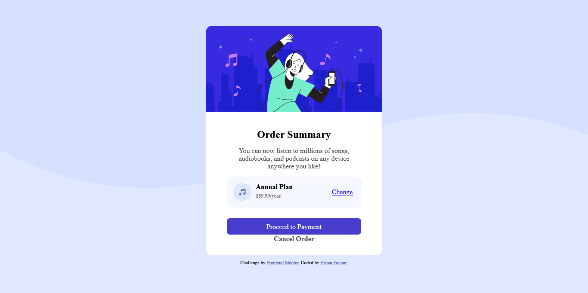

# Frontend Mentor - Order summary card solution

This is a solution to the [Order summary card challenge on Frontend Mentor](https://www.frontendmentor.io/challenges/order-summary-component-QlPmajDUj). Frontend Mentor challenges help you improve your coding skills by building realistic projects.

## Table of contents

- [Overview](#overview)
  - [The challenge](#the-challenge)
  - [Screenshot](#screenshot)
  - [Links](#links)
  - [Built with](#built-with)
  - [What I learned](#what-i-learned)
  - [Continued development](#continued-development)
- [Author](#author)

## Overview

Order summary Card Challenge from Frontend Mentor

### The challenge

Users should be able to:

- See hover states for interactive elements

### Screenshot

### Links

- Solution URL: [Github](https://github.com/FavourEzuzu/order-summary-component-main)
- Live Site URL: [live site URL](https://inspiring-chaja-9fce38.netlify.app)

### Built with

- Semantic HTML5 markup
- CSS custom properties
- Flexbox
- Mobile-first workflow

### What I learned

I learned to make the website responsive bu using percentage instead of using pixels and i also got better at using the flex box

### Continued development

I want to keep focusing on my responsiveness, grid and flexbox and completing more challenges

## Author

- Frontend Mentor - [Ezuzu Favour](https://www.frontendmentor.io/profile/FavourEzuzu)
- Twitter - [POM](https://twitter.com/favour__boy)
