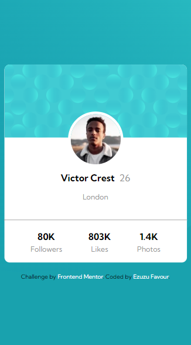
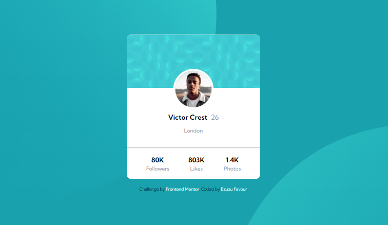

# Frontend Mentor - Profile card component solution

This is a solution to the [Profile card component challenge on Frontend Mentor](https://www.frontendmentor.io/challenges/profile-card-component-cfArpWshJ). Frontend Mentor challenges help you improve your coding skills by building realistic projects. 

## Table of contents

- [Overview](#overview)
  - [The challenge](#the-challenge)
  - [Screenshot](#screenshot)
  - [Links](#links)
  - [Built with](#built-with)
  - [What I learned](#what-i-learned)
  - [Continued development](#continued-development)
- [Author](#author)

**Note: Delete this note and update the table of contents based on what sections you keep.**

## Overview
A profile card challenge from Frontend Mentor
### The challenge

- Build out the project to the designs provided

### Screenshot

### Links

- Solution URL: [Add solution URL here](https://your-solution-url.com)
- Live Site URL: [Add live site URL here](https://your-live-site-url.com)

### Built with

- Semantic HTML5 markup
- CSS custom properties
- Flexbox
- CSS Grid
- Mobile-first workflow

### What I learned
  I learned to use the grid or flexbox to make my card align to the center..i also learned alot about the backgroung-image properties and lots more.

### Continued development

I want to continue building more cards and work on my shadowing and placing content better and also the background-image properties

## Author

- Frontend Mentor - [Ezuzu Favour](https://www.frontendmentor.io/profile/FavourEzuzu)
- Twitter - [Ezuzu Favour](https://www.twitter.com/favour__boy)

