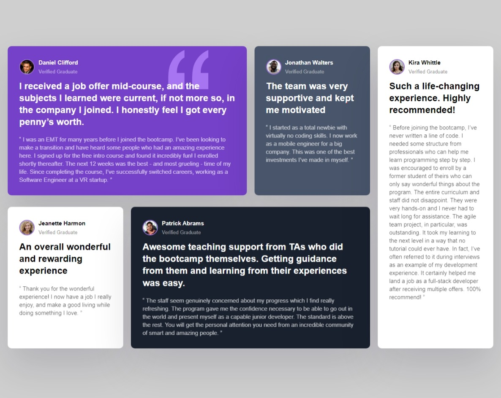

# Frontend Mentor - Testimonials grid section solution

This is a solution to the [Testimonials grid section challenge on Frontend Mentor](https://www.frontendmentor.io/challenges/testimonials-grid-section-Nnw6J7Un7). Frontend Mentor challenges help you improve your coding skills by building realistic projects. 

## Table of contents

- [Overview](#overview)
  - [The challenge](#the-challenge)
  - [Screenshot](#screenshot)
  - [Links](#links)
  - [Built with](#built-with)
- [Author](#author)

**Note: Delete this note and update the table of contents based on what sections you keep.**

## Overview

### The challenge

Users should be able to:

- View the optimal layout for the site depending on their device's screen size

### Screenshot

### Links

- Solution URL: [GitHub]([https://your-solution-url.com](https://github.com/FavourEzuzu/frontendmentor/tree/main/testimonials-grid-section-main))
- Live Site URL: [LiveSite]([https://your-live-site-url.com](https://zesty-creponne-7308cb.netlify.app))

## My process

### Built with

- Semantic HTML5 markup
- CSS custom properties
- Flexbox
- CSS Grid
- Mobile-first workflow

## Author

- Frontend Mentor - [Ezuzu Favour](https://www.frontendmentor.io/profile/FavourEzuzu)
- Twitter - [jxtcodes](https://twitter.com/favour__boy)
